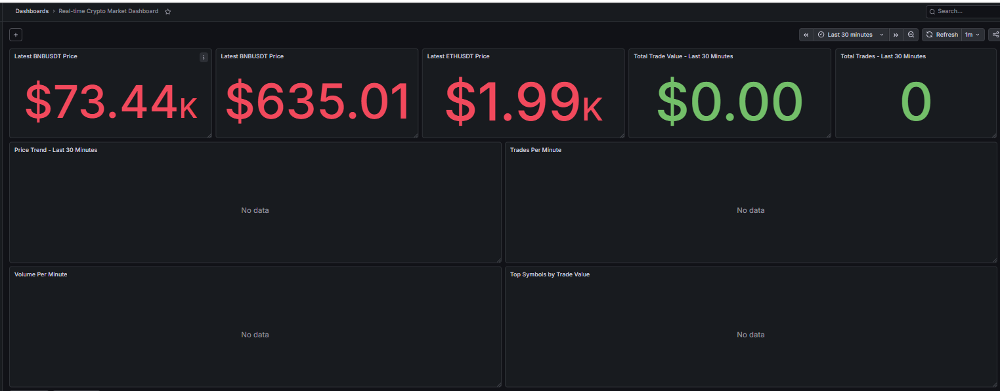
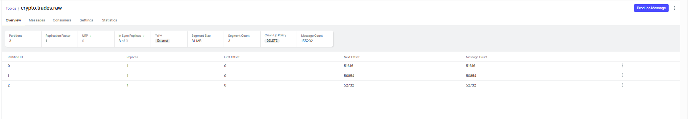
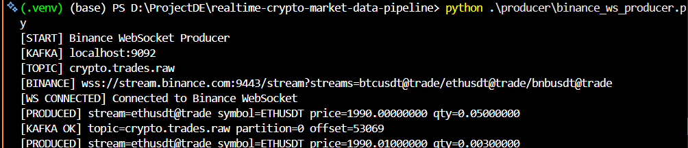
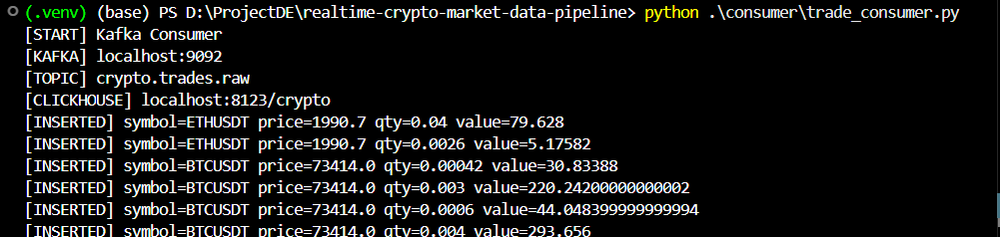
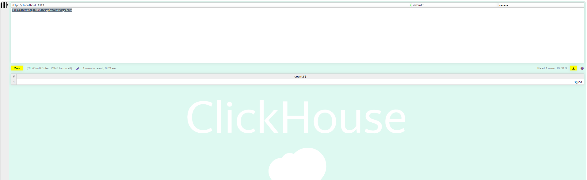

# Real-time Crypto Market Data Pipeline


## Overview

This project builds a real-time streaming data pipeline that ingests live cryptocurrency trade data from Binance WebSocket, publishes raw events to Apache Kafka, processes and validates events with a Python consumer, stores cleaned trade data in ClickHouse, and visualizes near real-time market metrics in Grafana.

Unlike CSV replay projects, this pipeline uses live streaming data from Binance Spot WebSocket, making it a real-time data engineering project.

---

## Architecture

```text
Binance WebSocket
        ↓
Python Producer
        ↓
Apache Kafka
        ↓
Python Consumer
        ↓
ClickHouse
        ↓
Grafana Dashboard
```

### Data Flow

1. The Python producer connects to Binance WebSocket streams.
2. Live trade events are published to Kafka topic `crypto.trades.raw`.
3. The Python consumer reads events from Kafka.
4. The consumer validates, transforms, and enriches trade data.
5. Cleaned trade data is inserted into ClickHouse.
6. Grafana queries ClickHouse and displays near real-time market metrics.

---

## Tech Stack

| Component | Purpose |
|---|---|
| Python | Producer and consumer services |
| Binance WebSocket | Live crypto trade data source |
| Apache Kafka | Streaming message broker |
| Kafka UI | Kafka topic and message monitoring |
| ClickHouse | OLAP database for fast analytical queries |
| Grafana | Real-time dashboard visualization |
| Docker Compose | Local infrastructure orchestration |

---

## Features

- Ingests live trade events from Binance WebSocket
- Streams raw events into Kafka
- Uses Kafka topic `crypto.trades.raw` for raw trade data
- Uses Kafka topic `crypto.trades.dead_letter` for invalid events
- Validates and transforms raw trade messages
- Converts price, quantity, and timestamp fields
- Calculates `trade_value = price * quantity`
- Stores cleaned trade data in ClickHouse
- Supports low-latency analytical queries
- Visualizes latest prices, trade count, volume, trade value, and price trends in Grafana
- Supports near real-time dashboard refresh

---

## Repository Structure

```text
realtime-crypto-market-data-pipeline/
│
├── producer/
│   └── binance_ws_producer.py
│
├── consumer/
│   └── trade_consumer.py
│
├── sql/
│   └── create_clickhouse_tables.sql
│
├── screenshots/
│   ├── producer.png
│   ├── consumer.png
│   ├── crypto_topic.png
│   ├── query_clickhouse.png
│   └── grafana_dashboard.png
│
├── docker-compose.yml
├── requirements.txt
├── .env.example
├── .gitignore
└── README.md
```

---

## Prerequisites

Make sure you have installed:

- Docker Desktop
- Python 3.10+
- Git

---

## Environment Variables

Create a `.env` file from `.env.example`.

### Windows PowerShell

```powershell
copy .env.example .env
```

### macOS / Linux

```bash
cp .env.example .env
```

Default `.env` configuration:

```env
KAFKA_BOOTSTRAP_SERVERS=localhost:9092
KAFKA_TOPIC_RAW=crypto.trades.raw
KAFKA_TOPIC_DEAD_LETTER=crypto.trades.dead_letter

BINANCE_WS_URL=wss://stream.binance.com:9443/stream?streams=btcusdt@trade/ethusdt@trade/bnbusdt@trade

CLICKHOUSE_HOST=localhost
CLICKHOUSE_PORT=8123
CLICKHOUSE_DATABASE=crypto
CLICKHOUSE_USERNAME=default
CLICKHOUSE_PASSWORD=123456
```

---

## Installation

Create a Python virtual environment:

```bash
python -m venv .venv
```

Activate the virtual environment.

### Windows PowerShell

```powershell
.venv\Scripts\activate
```

### macOS / Linux

```bash
source .venv/bin/activate
```

Install Python dependencies:

```bash
pip install -r requirements.txt
```

---

## How to Run

### 1. Start infrastructure services

```bash
docker compose up -d
```

This starts:

- Kafka
- Kafka UI
- ClickHouse
- Grafana

Check running containers:

```bash
docker ps
```

Expected containers:

```text
crypto-kafka
crypto-kafka-ui
crypto-clickhouse
crypto-grafana
```

---

### 2. Run the Binance WebSocket producer

```bash
python producer/binance_ws_producer.py
```

The producer connects to Binance WebSocket and publishes live trade events to Kafka.

Expected output:

```text
[PRODUCED] stream=btcusdt@trade symbol=BTCUSDT price=... qty=...
[PRODUCED] stream=ethusdt@trade symbol=ETHUSDT price=... qty=...
[PRODUCED] stream=bnbusdt@trade symbol=BNBUSDT price=... qty=...
```

---

### 3. Run the Kafka consumer

Open another terminal and run:

```bash
python consumer/trade_consumer.py
```

The consumer reads events from Kafka, transforms them, and inserts cleaned data into ClickHouse.

Expected output:

```text
[INSERTED] symbol=BTCUSDT price=... qty=... value=...
[INSERTED] symbol=ETHUSDT price=... qty=... value=...
[INSERTED] symbol=BNBUSDT price=... qty=... value=...
```

---

## Service URLs

| Service | URL |
|---|---|
| Kafka UI | http://localhost:8080 |
| Kafka Broker | localhost:9092 |
| ClickHouse HTTP | http://localhost:8123 |
| Grafana | http://localhost:3000 |

Grafana default login:

```text
Username: admin
Password: admin
```

ClickHouse credentials:

```text
Username: default
Password: 123456
Database: crypto
```

---

## Kafka Topics

| Topic | Purpose |
|---|---|
| `crypto.trades.raw` | Stores raw trade events from Binance WebSocket |
| `crypto.trades.dead_letter` | Stores invalid or failed events |

Kafka topics are auto-created when the producer starts.

You can monitor topics in Kafka UI:

```text
http://localhost:8080
```

---

## ClickHouse Tables

| Table | Purpose |
|---|---|
| `crypto.trades_clean` | Stores cleaned trade events |
| `crypto.dead_letter_events` | Stores invalid events and error messages |

### Main Cleaned Trade Schema

| Column | Description |
|---|---|
| `event_time` | Binance event time |
| `trade_time` | Binance trade time |
| `symbol` | Trading pair, for example `BTCUSDT` |
| `trade_id` | Binance trade ID |
| `price` | Trade price |
| `quantity` | Trade quantity |
| `trade_value` | `price * quantity` |
| `is_buyer_market_maker` | Market maker flag from Binance |
| `ingested_at` | ClickHouse ingestion timestamp |

---

## Useful ClickHouse Queries

Connect to ClickHouse:

```bash
docker exec -it crypto-clickhouse clickhouse-client --user default --password 123456
```

Check tables:

```sql
USE crypto;
SHOW TABLES;
```

Check total rows:

```sql
SELECT count()
FROM crypto.trades_clean;
```

View latest trades:

```sql
SELECT *
FROM crypto.trades_clean
ORDER BY trade_time DESC
LIMIT 10;
```

Aggregate by symbol:

```sql
SELECT
    symbol,
    count() AS trade_count,
    sum(quantity) AS volume,
    sum(trade_value) AS trade_value
FROM crypto.trades_clean
GROUP BY symbol
ORDER BY trade_value DESC;
```

Trades per minute:

```sql
SELECT
    toStartOfMinute(trade_time) AS minute,
    symbol,
    count() AS trade_count,
    sum(quantity) AS volume,
    sum(trade_value) AS trade_value
FROM crypto.trades_clean
GROUP BY minute, symbol
ORDER BY minute DESC;
```

---

## Grafana Setup

Open Grafana:

```text
http://localhost:3000
```

Add a ClickHouse data source with the following settings:

| Field | Value |
|---|---|
| Server address | `clickhouse` |
| Server port | `8123` |
| Protocol | `HTTP` |
| Secure Connection | Off |
| Username | `default` |
| Password | `123456` |
| Database | `crypto` |

> Note: In Grafana, use `clickhouse` as the server address because Grafana runs inside Docker and connects to ClickHouse through the Docker Compose network.

---

## Grafana Dashboard Metrics

The dashboard monitors:

- Latest BTCUSDT price
- Latest ETHUSDT price
- Latest BNBUSDT price
- Total trades in the selected time window
- Total trade value
- Price trend
- Trades per minute
- Volume per minute
- Top symbols by trade value

Recommended dashboard settings:

```text
Time range: Last 30 minutes
Refresh interval: 10s or 1m
```

---

## Example Grafana Queries

### Latest BTCUSDT Price

```sql
SELECT
    price
FROM crypto.trades_clean
WHERE symbol = 'BTCUSDT'
ORDER BY trade_time DESC
LIMIT 1;
```

### Latest ETHUSDT Price

```sql
SELECT
    price
FROM crypto.trades_clean
WHERE symbol = 'ETHUSDT'
ORDER BY trade_time DESC
LIMIT 1;
```

### Total Trades

```sql
SELECT
    count() AS total_trades
FROM crypto.trades_clean
WHERE trade_time + INTERVAL 7 HOUR >= now() - INTERVAL 30 MINUTE;
```

### Total Trade Value

```sql
SELECT
    round(sum(trade_value), 2) AS total_trade_value
FROM crypto.trades_clean
WHERE trade_time + INTERVAL 7 HOUR >= now() - INTERVAL 30 MINUTE;
```

### Price Trend

```sql
SELECT
    trade_time + INTERVAL 7 HOUR AS time,
    symbol AS metric,
    price AS value
FROM crypto.trades_clean
WHERE trade_time + INTERVAL 7 HOUR >= now() - INTERVAL 30 MINUTE
ORDER BY time;
```

### Trades Per Minute

```sql
SELECT
    toStartOfMinute(trade_time + INTERVAL 7 HOUR) AS time,
    symbol AS metric,
    count() AS value
FROM crypto.trades_clean
WHERE trade_time + INTERVAL 7 HOUR >= now() - INTERVAL 30 MINUTE
GROUP BY time, symbol
ORDER BY time;
```

### Volume Per Minute

```sql
SELECT
    toStartOfMinute(trade_time + INTERVAL 7 HOUR) AS time,
    symbol AS metric,
    sum(quantity) AS value
FROM crypto.trades_clean
WHERE trade_time + INTERVAL 7 HOUR >= now() - INTERVAL 30 MINUTE
GROUP BY time, symbol
ORDER BY time;
```

### Top Symbols by Trade Value

```sql
SELECT
    symbol,
    round(sum(trade_value), 2) AS trade_value
FROM crypto.trades_clean
WHERE trade_time + INTERVAL 7 HOUR >= now() - INTERVAL 30 MINUTE
GROUP BY symbol
ORDER BY trade_value DESC;
```

---

## Timezone Note

Binance event timestamps are stored in UTC. If your local timezone is UTC+7, Grafana time-series queries may need:

```sql
trade_time + INTERVAL 7 HOUR
```

This adjustment is used in the example Grafana queries above.

---

## Screenshots

### Grafana Dashboard



### Kafka Topic



### Producer Running



### Consumer Running



### ClickHouse Query



---

## Troubleshooting

### Kafka port already in use

This project uses Kafka on `localhost:9092`.

If you already have another Kafka container running on port `9092`, stop it first:

```bash
docker stop kafka-server kafka-ui
```

Or change the Kafka port mapping in `docker-compose.yml`.

---

### Kafka connection timeout

Make sure `.env` uses:

```env
KAFKA_BOOTSTRAP_SERVERS=localhost:9092
```

Do not use the Kafka UI port as the Kafka broker port.

Wrong:

```env
KAFKA_BOOTSTRAP_SERVERS=localhost:8080
```

Correct:

```env
KAFKA_BOOTSTRAP_SERVERS=localhost:9092
```

---

### ClickHouse connection refused

Check container logs:

```bash
docker logs crypto-clickhouse --tail=100
```

Check if ClickHouse is running:

```bash
docker ps
```

Test ClickHouse HTTP endpoint:

```bash
curl http://localhost:8123/ping
```

Expected output:

```text
Ok.
```

---

### Grafana cannot connect to ClickHouse

Inside Grafana, use:

```text
Server address: clickhouse
Port: 8123
Protocol: HTTP
Secure Connection: Off
Username: default
Password: 123456
```

Do not use `localhost` as the ClickHouse server address inside Grafana, because `localhost` refers to the Grafana container itself.

---

## Project Highlights

This project demonstrates a real-time streaming data pipeline, not a batch pipeline or CSV replay pipeline.

Key data engineering concepts demonstrated:

- Real-time ingestion
- WebSocket data source
- Kafka-based event streaming
- Producer-consumer architecture
- Dead-letter handling
- Data validation and transformation
- OLAP storage with ClickHouse
- Near real-time dashboarding with Grafana
- Docker-based local infrastructure

---

## Future Improvements

- Dockerize producer and consumer services
- Add a `trades_1m` aggregate table for minute-level OHLCV metrics
- Export Grafana dashboard JSON into the repository
- Add data quality checks
- Add producer and consumer health check scripts
- Add Airflow for scheduled monitoring and batch aggregation jobs
- Add alerting for pipeline failures or stale data
- Add more symbols and configurable stream subscriptions

---

## CV Description

**Real-time Crypto Market Data Pipeline | Python, Kafka, ClickHouse, Grafana, Docker**

- Built a real-time streaming pipeline that ingests live Binance trade data through WebSocket and publishes events to Kafka.
- Developed Python producer and consumer services to process trade events continuously with validation and error handling.
- Designed Kafka topics for raw trade events and dead-letter events.
- Stored cleaned trade data in ClickHouse for low-latency analytical queries.
- Built Grafana dashboards to monitor live crypto prices, trade volume, trade count, top symbols, and market activity.